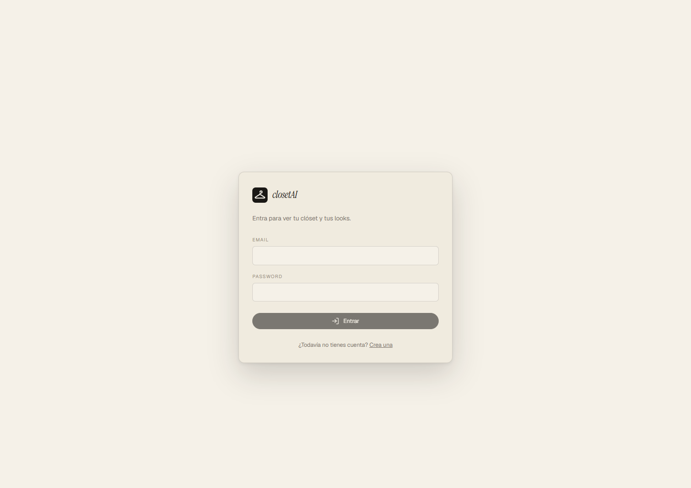

# closetAI

Fotografías una prenda, la IA la cataloga y te arma looks **usando sólo ropa que ya
tienes**. Web responsive, mismo código en escritorio y móvil.



## Qué hace

La premisa es que un recomendador de moda que te sugiere ropa que no posees no
sirve de nada. Aquí el catálogo es tu armario:

- **Clóset con etiquetado automático.** Subes fotos de una prenda y un modelo de
  visión propone tipo, color, patrón, corte y temporadas. Lo que devuelve es un
  borrador: la prenda queda `SUGGESTED` y no entra en ningún look hasta que la
  confirmas.
- **Motor de compatibilidad determinista.** Código puro que puntúa combinaciones
  por armonía de color, formalidad, temperatura y ajuste. Es gratis, no llama a
  ningún proveedor y sus resultados se pueden reproducir.
- **Estilista LLM por encima del motor, no en su lugar.** El modelo recibe sólo
  las prendas que el motor ya validó y las nombra por ids cortos que existen
  únicamente durante la petición, así que **inventar ropa no se le pide: se le
  impide**. Aporta la narrativa; la paleta, el rango térmico y los slots los
  calcula el motor.
- **Bucle de aprendizaje.** Rechazar un look cambia el siguiente, y cada motivo
  de rechazo alimenta la señal que le corresponde: el color penaliza esa pareja
  cromática, "demasiado formal" desplaza la formalidad objetivo, y así.

## Estado

El MVP llega hasta la Fase 4. Las fases 0 a 2 están cerradas y verificadas; la 3
y la 4 están implementadas y a falta de la verificación manual con una clave real
de OpenAI. No hay todavía análisis de vacíos (5), render por IA (6) ni PWA (7).

La tabla de seguimiento vive en [plan.md](plan.md) y es la que manda.

## Stack

| Capa       | Tecnología                                         |
| ---------- | -------------------------------------------------- |
| Frontend   | Angular 21 standalone **zoneless** + Tailwind 4    |
| Backend    | NestJS 10 + Fastify 4, Zod 3 de punta a punta      |
| Datos      | PostgreSQL + Prisma 6                              |
| Compartido | `@closetai/shared-types` — esquemas Zod front/back |
| Monorepo   | pnpm workspaces + Turborepo                        |

## Puesta en marcha

Necesitas **Node 22+**, **pnpm 11+** y un PostgreSQL accesible.

```bash
pnpm install

# Configura el backend: copia la plantilla y complétala
cp apps/backend/.env.example apps/backend/.env

# Genera el par RSA con el que el cliente cifra el password y pega la línea en .env
pnpm --filter @closetai/backend gen:rsa

# Crea el esquema y siembra el catálogo de tipos de prenda
pnpm --filter @closetai/backend prisma:migrate
pnpm --filter @closetai/backend db:seed

pnpm dev
```

Frontend en `http://localhost:4200`, backend en `http://localhost:3000`, Swagger
en `http://localhost:3000/docs` (desactivado en producción).

`OPENAI_API_KEY` es **opcional**: sin ella el backend arranca igual y los
endpoints de IA responden 503 con un mensaje claro. El clóset, el perfil y el
motor determinista funcionan con normalidad.

> El listado completo de comandos (build, tests, lint, migraciones, Prisma Studio,
> reset de base) está en [CLAUDE.md](CLAUDE.md), que es la única fuente de verdad
> y no se duplica aquí para que no se desincronicen.

## Seguridad y privacidad

Decisiones que están en el código, no sólo en la intención:

- **El storage no es público.** Nada se sirve como carpeta estática: los archivos
  se leen por un endpoint que exige sesión y comprueba que la key pertenezca al
  usuario. La ruta se valida contra recorrido de directorios antes de tocar disco.
- **El EXIF se elimina** al normalizar cada imagen a WebP, así que no se guarda la
  geolocalización de la foto.
- **El aislamiento por usuario es explícito** en cada consulta, no delegado a un
  middleware que se pueda olvidar.
- **El password viaja cifrado con RSA-OAEP** sobre HTTPS, para que no acabe en
  claro en el log de un proxy o un APM.
- **La sesión muere por inactividad** y eso lo garantiza la vida de los tokens en
  el servidor, no una regla del cliente.
- **El prompt de visión prohíbe describir a la persona de la foto** y el esquema
  no tiene ningún campo donde hacerlo. Nada de inferir género, peso o complexión
  desde una imagen.

## Documentación

- [CLAUDE.md](CLAUDE.md) — arquitectura, comandos, convenciones y trampas conocidas.
- [plan.md](plan.md) — plan por fases, modelo de datos y diseño del motor.

## Licencia

[MIT](LICENSE).
